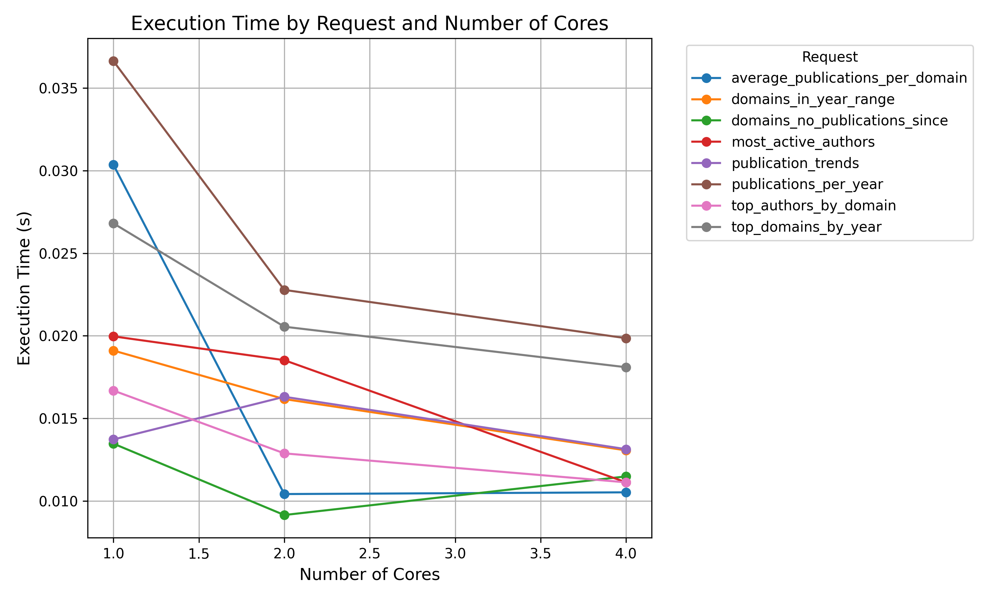
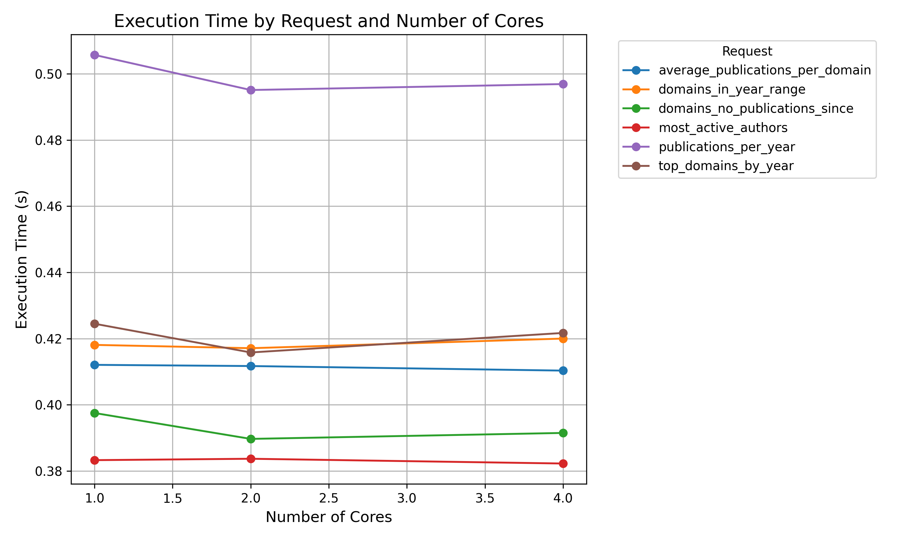

# Analyse-des-publications-UPEC


Ce projet universitaire vise à analyser les publications de l'UPEC enregistrées sur [la plateforme HAL](https://hal.science/)
en utilisant PySpark pour le traitement des données. Il inclut également des scripts de scraping pour collecter et crée la base de donnée, ainsi que des graphiques et rapports générés à partir de l'analyse de ses données.

Ce git se présente sous la forme d'une application web utilisant le framework django. L’application web inclut les fonctionnalités suivantes :

• Recherche par langage naturel : Permettant aux utilisateurs d’interroger la base de données de manière intuitive (utilisation de la librairie [py-sparkai](https://spark.apache.org/docs/latest/api/python/index.html))

• Affichage des résultats de classification : Présentation
des publications avec les domaines de publications correspondants avec classification dynamique ERC par IA.

• Exportation des résultats : Possibilité d’exporter les
résultats en format CSV pour une utilisation ulterieure
## Dossier ressource

Voici une description du dossier ressources, où sont indiqués les données produites et manipulés ainsi que des exemples et traces d'utilisation.

```
ressources/
├── data/ # Dossiers contenant les données brutes et traitées
│
├── images/ # Dossiers pour les images (logs, captures d'écran, etc.)
│
├── scripts/ # Scripts utilisés pour le scraping et la création de la base de données
│
├── graphs/ # Graphiques générés à partir des données analysées
│
├── ia/ # Prédiction des Domaines de Recherche
│
└── Rapport_Megadonnées-1.pdf # Rapport détaillant les résultats de l'analyse
```

## Jeu de données

Le jeu de données utilisé dans ce projet est issu de la
plateforme HAL et se présente sous la forme d’un fichier CSV
structuré avec les colonnes suivantes :
• Nom du chercheur : Nom de famille de l’auteur de la
publication.
• Prénom du chercheur : Prénom de l’auteur.
• Nom complet : Concaténation du prénom et du nom.
• Nom complet abrégé : Contraction du prénom et du nom
(forme abrégée).
• Doc ID : Identifiant unique de la publication.
• Titre de la publication : Titre complet de la publication
scientifique.
• Domaine de recherche : Catégorie HAL associée à la
publication.
• Résumé : Brève description du contenu de la publication.
• Date : Date de publication.

Les données brutes étant trop volumineuses, elle ne peuvent pas être stockées sur ce git. Cependant les scripts permettant de la réaliser sont disponibles dans le dossier `ressource/scripts`.

Pour ce projet, 2 méthodes différents ont été réalisés pour crée la base de données. Le premier est un script faisant l'appel à l'API HAL (`ressource/scripts/scrap_by_api.py`.)

Au vu des quantités de requêtes effectués pour la création de la table, nous avons optés dans un second temps sur une seconde méthode qui consiste au téléchargement de la [sauvegarde de la base de données HAL](https://data.hal.science/backup) (fichiers en .rdf) afin de les transformer en fichier csv (`ressources/scripts/scrap_from_backup.py`).

*Pour le fonctionnement de l'application django, il faut ensuite transformer la base de données csv en fichiers db.sqlite

## Intelligence Artificielle : Prédiction des Domaines de Recherche

Cette section décrit les fichiers et l'arborescence liés au modèle d'IA pour la prédiction des domaines de recherche spécifiques à HAL vers le Panel ERC.

### Arborescence du fichier ZIP

```
modèle ia-20250212T150700Z-001/
├── domaine.csv                  # Oracle de transcription entre les domaines de recherche HAL et le Panel ERC
├── date_propre.csv                 # Base de données sous format CSV
├── date_propre       # Base de données sous format Google Sheets
├── erc_panel_predictor.joblib   # Modèle d'IA entraîné pour la prédiction des domaines ERC
├── mlb.joblib               # Transforme les étiquettes multilabel en représentation binaire
├── tfidf.joblib             # Module de vectorisation TF-IDF pour le modèle
├── ERC.ipynb                # Notebook Jupyter pour l'entraînement du modèle
├── publications_with_predicted_erc.csv          # Prédictions des domaines ERC au format CSV
└── publications_with_predicted_erc # Prédictions des domaines ERC au format Google Sheets
``` 

Description des Fichiers

`domaine.csv` :
    Ce fichier sert d'oracle de transcription entre les domaines de recherche spécifiques à HAL et les domaines du Panel ERC. Il est utilisé pour mapper les domaines de HAL vers les catégories ERC.


`date_propre.csv` : Fichier CSV contenant les données nettoyées.

`data_google_sheets` : fichier vers la même base de données au format Google Sheets.

`erc_panel_predictor.joblib` :
    Ce fichier contient le modèle d'IA entraîné pour prédire les domaines du Panel ERC à partir des domaines de recherche HAL.

`mlb.joblib` : Transforme les étiquettes multilabel en une représentation binaire.

`tfidf.joblib` : Module de vectorisation TF-IDF utilisé pour prétraiter les données textuelles.

`Model Domains/ERC.ipynb` :
    Ce notebook Jupyter contient le code utilisé pour l'entraînement du modèle. Il inclut les étapes de prétraitement des données, d'entraînement du modèle et d'évaluation des performances.

`publications_with_predicted_erc.csv` : Fichier CSV contenant les prédictions des domaines ERC.

`publications_with_predicted_erc` : fichier avec les mêmes prédictions dans Google Sheets.

## Graphiques et données

Les graphiques générés à partir des données analysées sont stockés dans le dossier `ressources/graphs/` ainsi que les données de performances de pyspark dans le fichier temps_execution_pyspark.csv.

A l'aide de ses données, les 2 grahiques suivants ont pu être générés avec les scripts présent dans le dossier.

* HAL UPEC (30000 entrées)


* Une sous-partie de HAL (400000 entrées)



## Rapport

Le rapport détaillant les résultats de l'analyse est disponible dans le fichier `ressources/Rapport_Megadonnées-1.pdf`. Il inclut :
- Une description des données.
- Les méthodes d'analyse utilisées.
- Les conclusions et observations.